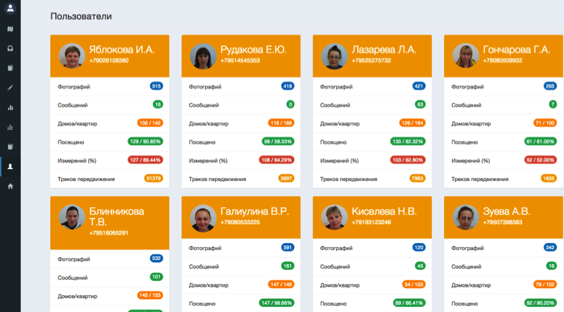
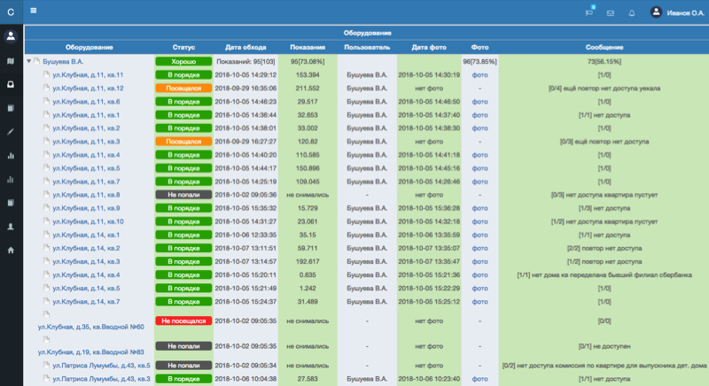
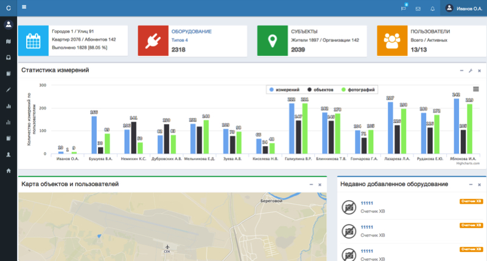
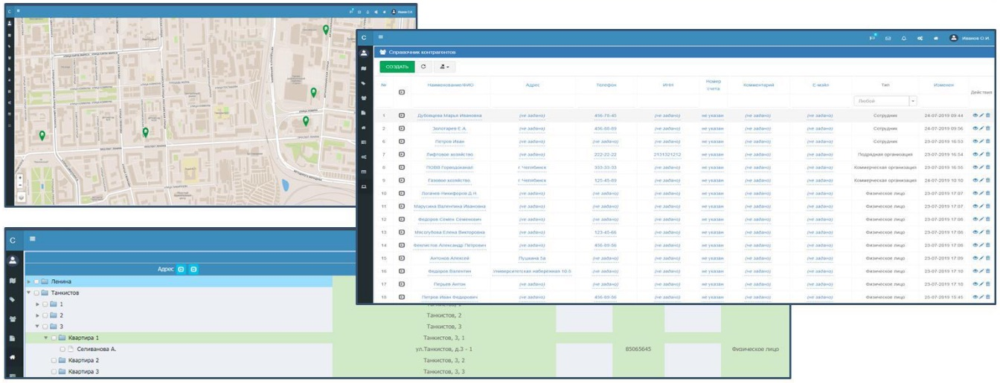
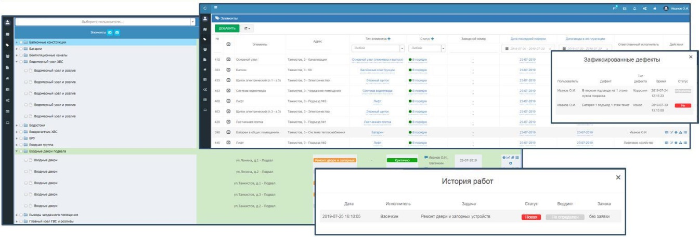
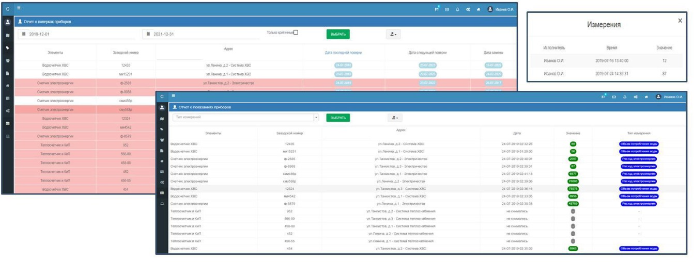

<h2>Описание</h2>

Программный комплекс Serviceman предназначен для сбора данных/показаний счетчиков, для автоматизации процесса съема показаний индивидуальных и общедомовых приборов учета воды.
Задача сервера обеспечить интерфейс обмена данными с мобильными приложениями контроллеров (смартфоны с Android) через встроенный API, обеспечить хранение, обработку и визуализацию собранных данных.
Сервер реализован на базе фреймворка Yii2 (PHP) [AdminLTE].

API обеспечивает авторизацию пользователей, выдачу токенов, передачу на клиенты базовых справочников и объектов, назначенных пользователю. В обратную сторону уходят треки передвижения пользователей, измерения, новые счетчики, сообщения о проблемах, фотографии объектов и оборудования.  
Все это сохраняется в базе данных (MySQL). 
Интерфейс пользователя позволяет наполнять справочники, формировать базу данных объектов, контроллировать работу пользователей, их текущее местоположение и трек передвижения на карте (OSM), статистику обходов по улицам и контролерам, а также множество других параметров. 
Консольные скрипты позволяют обрабатывать входные файлы с данными в формате Excel, обновлять базу данных. 

 
Скриншоты интерфейса приведены ниже:
 
 

<h2>Инсталляция и настройка</h2>
Инсталляция стандартная: git clone, init, правка конфигов доступа к базе, yii migrate/up --db=<база данных> для развертывании базы и формировании пользователя по-умолчанию.

Развитие системы

Сервер системы автоматизации технического обслуживания объектов инфраструктуры
Цель создания системы - предоставление информационной среды, позволяющей оптимизировать процессы управления обслуживанием инженерной инфраструктуры для управляющих компаний.
Сервер системы системы представляет собой облачное решение с отдельной базой данных для каждой отдельной компании. Сервер реализован на базе фреймворка Yii2 (Kartik, Leaflet, AdminLTE, PHPOffice, cron).

